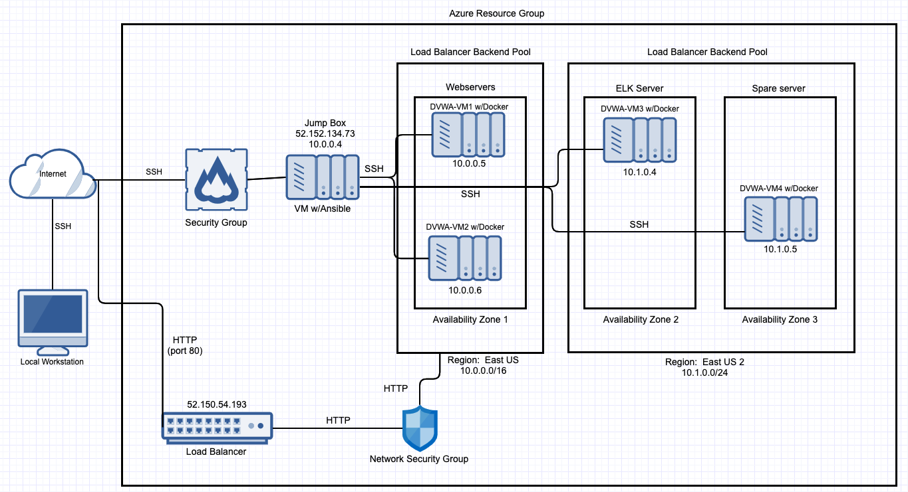
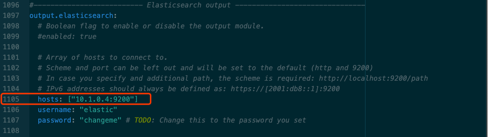

# Azure-Cloud-Network-Desgin

This document contains the following details:
- [Description of the Topology](#description-of-the-topology)
- [Access Policies](#access-policies)
- [Jump box Configuration](#jump-box-configuration)
- [Ansible Configuration](#ansible-configuration)
  - [How to Use the Ansible Build Automated Deployment](#how-to-use-the-ansible-build-automated-deployment)
    - [ELK Configuration](#elk-configuration)
      - [Target Machines and Beats](#target-machines-and-beats)
    - [Webserver Deployment](#webserver-deployment)
    - [Filebeat Deployment](#filebeat-deployment)
    - [Metricbeat Deployment](#metricbeat-deployment)
- [Redundancy Testing](#redundancy-testing)

The files in this repository were used to create and configure the network depicted below.

The main purpose of this network is to expose a load-balanced and monitored instance of DVWA, the D*mn Vulnerable Web Application.

### Description of the Topology

[Azure-Network-architecture](Images/Azure-Network-architecture.png)

- Jump box
  - region: East US
  - private IP: 10.0.0.4 
  - public IP (static): 40.87.101.129
- DVWA-VM1
  - region: East US
  - availability zone: 1
  - private IP: 10.0.0.5
- DVWA-VM2
  - region: East US
  - availability zone: 1
  - private IP: 10.0.0.6
- DVWA-VM3
  - region: East US2
  - availability zone: 2
  - private IP: 10.1.0.4
- DVWA-VM4 (spare server machine, can be used for testing purpose in this practice)
  - region: East US2
  - availability zone: 3
  - private IP: 10.1.0.5
- Firewall
  - add whitelist of IPs
  - setup inbound rules to only allow the IP in the whitelist access the jump-box from external network
- Load balancer
  - Fronted IP Configuration: 52.150.54.193 (pip1)
  - Backend pools: DVWA-VM1 and DVWA-VM2
  - Health probes: setup for load balancing rule and detect the failure of an application on a backend endpoint
  - Load balancing rules: open port 80 for HTTP

Load balancing ensures that the application will be highly available (responsive), in addition to restricting traffic to the network.
- The load balancers defend an organization against distributed denial-of-service (DDoS) attack by rerouting heavy traffic from one server to another to eliminate single points of failure, reduce the attack surface, and make it harder to exhaust resources and saturate links. The advantage of a jump box here is to prevents all Azure VM's to expose to the public, which means that the jump box will be our entry point connecting via Remote Desktop Protocol (RDP) from our on-premise network. In addition, the jump box also helps us to open only one port instead of several ports to connect different VMs in the Azure cloud.

Integrating an ELK server allows users to easily monitor the vulnerable VMs for changes to the infrastructure and system logs.
- Filebeat is used for collecting and shipping log files. It can be installed on almost any operating system, including as a Docker container.
- Metricbeat collects ships various system-level metrics for various systems and platforms.

The configuration details of each machine may be found below.

| Name     | Function     | IP Address | Operating System |
|----------|--------------|------------|------------------|
| Jump Box | Gateway      | 10.0.0.4   | Linxu            |
| DVWA-VM1 | Webserver    | 10.0.0.5   | Linux            |
| DVWA-VM2 | Webserver    | 10.0.0.6   | Linux            |
| DVWA-VM3 | ELK Server   | 10.1.0.4   | Linux            |
| DVWA-VM4 | Spare Server | 10.1.0.5   | Linux            |

These files have been
- Tested and configure the **jump box** to run **Docker containers** and to install a **container**
- Tested and used to generate **webserver containers**, a live **ELK deployment** and **loadbalancer** on Azure. They can be used to either recreate the entire deployment pictured above. Alternatively, select portions of the yml file may be used to install only certain pieces of it, such as __Filebeat__.

**_Note: It is necessary to setup peering for VMs connections between different regions_**

### Access Policies

The machines on the internal network are not exposed to the public Internet. 

Only the Jump-box machine can accept connections from the Internet. Access to this machine is only allowed from the following IP addresses:
- _Add whitelisted IP addresses into the firewall rules to allow the inbound access, ex. I added the IP address of my local machine_

Machines within the network can only be accessed by the Jump-box machine and other machines in the network.
- Only my local machine which is in the whitelisted machine added into the firewall rules (you can use [https://whatismyipaddress.com/](https://whatismyipaddress.com/) to check your IP address) from Internet can access the ELK server besides all other machines within the network.

A summary of the access policies in place can be found in the table below.

| Name     | Publicly Accessible | Allowed IP Addresses                                                                               |
|----------|---------------------|----------------------------------------------------------------------------------------------------|
| Jump Box | Yes                 | IP-in-whitelist (ex. IP-of-my-own-machine)                                                         |
| DVWA-VM1 | Yes                 | Any                                                                                                |
| DVWA-VM2 | Yes                 | Any                                                                                                |
| DVWA-VM3 | Yes                 | 10.0.0.4 10.0.0.5 10.0.0.6 10.1.0.5 IP-in-whitelist (from external network, ex. My-own-machine-IP) |
| DVWA-VM4 | Yes                 | 10.0.0.4 10.1.0.4                                                                                  |

### Jump box Configuration

- Generate a RSA key pair for the SSH connection to the jump-box machine

		sudo ssh-keygen
		
- Copy the SSH public key and paste it into the required filed for SSH connection when you create jump-box machine or you can redeploy it in the **Reset password** section after you created jump-box machine

- Create a new security group rule that allows your jump-box machine full access to your VNet
  - Get the private IP address of your jump-box machine
  - Go to your security group settings and create an **inbound** rule. Create rules allowing **SSH** connections from your IP address
    - Source: Use the **IP Addresses** setting with your jump-box machine's internal IP address in the field
    - Source port ranges: **Any** or \* can be listed here
    - Destination: Set to **VirtualNetwork**
    - Destination port ranges: Only allow SSH. So, only port **22**
    - Protocol: Set to **Any** or **TCP**
    - Action: Set to **Allow** traffic from your jump-box machine
    - Priority: Priority must be a lower number than your rule to deny all traffic
    - Name: Name this rule anything you like, but it should describe the rule. _For example: SSH from Jump Box_
    - Description: Write a short description similar to: "_Allow SSH from the jump-box machine IP_"

### Ansible Configuration

- Connect to your jump-box machine
       
        ssh -i path/private-key username@Jump-box-VM-public-IP
        
    
  
- start by installing **docker.io** on the jump-box machine
        
        sudo apt install docker.io
        
- verify that the Docker service is running
        
        sudo systemctl service docker
        
- Once Docker is installed, pull the container **cyberxsecurity/ansible**
        
        sudo docker pull cyberxsecurity/ansible
    - _NOTE: you can also switch to the root user so you don't have to keep tying **sudo**_
    
- Launch the Ansible container and connect to it using the appropriate Docker commands
  - To start the container
       
        sudo docker run -ti cyberxsecurity/ansible:latest bash
        
  - If the Ansible has been installed, use commands below:
    - if you don't remember the name of your container, run the command below to check the name
         
            sudo docker container list -a
        
  	- Start the container using
          
            sudo docker start container_name
        
  	- Get a shell in your container using
           
            sudo docker attach container_name
        
  - To quit the container
        
        exit
        
#### How to Use the Ansible Build Automated Deployment

- Connect to your Ansible container. Once you're connected, create a new SSH key and copy the public key
  - Run `ssh-keygen` to create an SSH key
  - Run `ls .ssh/` to view SSH key
  - Run `cat .ssh/id_rsa.pub` to display the public key
  - Copy the public key string
  
- Return to the Azure portal and create a new VM (DVWA-VM1). Use all the same settings you used on the first VM (jump-box)
  - **_Note: this procedure will be used for service or application deployment to all DVWA-VMs_**

- After your VM launches, test your connection using **ssh** from your jump box Ansible container

        ssh ansible@new-created-vm-IP
        
  - Note: If only TCP connections are enabled for `SSH` in your security group rule, ICMP packets will not be allowed, so you will not be able to use `ping`

- Exit this SSH session by running `exit` if the `SSH` connection was able to establish

- Locate the Ansible config file and hosts file

        ls /etc/ansible
        
  - Add this machine's internal IP address to the Ansible hosts file
  - Open the file with `nano /etc/ansible/hosts`
  - Uncomment the `[webservers]` header line
  - Add the internal IP address under the `[webservers]` header
  
- Change the Ansible configuration file to use your administrator account for SSH connections

  - Open the file with `nano /etc/ansible/ansible.cfg` and scroll down to the **remote\_user** option
  - Uncomment the **remote\_user** line and replace **root** with your admin username
  
- Test an Ansible connection using the appropriate Ansible command

        ansible -m ping all

##### Elk Configuration

Ansible was used to automate configuration of the ELK machine. No configuration was performed manually, which is advantageous because...

- Free: Ansible is an open-source tool
- Idempotent: can be used to deploy to the multiple machine with identical settings
- Powerful: Ansible lets you model even highly complex IT workflows
- Efficient: you don't need to install any extra software, there's more room for application resources on your server
- Tiny Learning Curve: no special coding skills are needed to use Ansible's playbook

1. Create a New VM as ELK server

2. Downloading and Configuring the Container
- Add the new VM to the Ansible `hosts` file
- Create a new Ansible playbook to use for the new ELK server machine

  - The playbook implements the following tasks:
    - The header of the Ansible playbook can specify a different group of machines as well as a different remote user (in case you did not use the same admin name)
            
            - name: Config elk VM with Docker
              hosts: elkservers
              remote\_user: elk
              become: true
              tasks:
    
    - The first task of the playbook needs to increase the virtual memory on the VM by running this command:
            
            sysctl -w vm.max_map_count=262144
        _Note: This is a system requirement for the ELK container. More info at the [elk-docker documentation](https://elk-docker.readthedocs.io/#prerequisites)

    - The playbook should then install the following services:
      - **docker.io**
      - **python-pip**
      - **docker**, which is the Docker Python module

The following screenshot displays the result of running `docker ps` after successfully configuring the ELK instance.

      
3. Launching and Exposing the Container

After Docker is installed, download and run the **sebp/elk** container

- The container should be started with these published ports:
  - `5601:5601`
  - `9200:9200`
  - `5044:5044`

- SSH from your Ansible container to your ELK machine to verify the connection before you run your playbook
- After the ELK container is installed, SSH to your container and double check that your **elk-docker** container is running

4. Identity and Access Management
This ELK web server runs on port `5601`. Create an incoming rule for your security group that allows TCP traffic over port `5601` from your IP address

Verify that you can load the ELK stack server from your browser at **http://[your.VM.IP]:5601**

###### Target Machines and Beats

This ELK server is configured to monitor the following machines:

- DVWA-VM1: 10.0.0.5
- DVWA-VM2: 10.0.0.6

We have installed the following Beats on these machines:

- filebeat: DVWA-VM1 and DVWA-VM2
- metricbeat: DVWA-VM1 and DVWA-VM2

##### Webserver Deployment

To create an Ansible plyabook that installed Docker and configure a VM with the DVWA web app.
        
- Create a YAML playbook file that you will use for web app configuration

  - The playbook  should read similar to /etc/ansible/[webserver-playbook.yml](YMAL/Webserver/webserver-playbook.yml), the details for each part in the playbook as depicted below:

    - Use the Ansible **apt** module to install **docker.io** and **python-pip**
    
            - name: docker.io
              apt:
              force_apt_get: yes
              name: docker.io
              state: present
           
            - name: Install pip
              apt:
              force_apt_get: yes
              name: python-pip
              state: present"
              
  - Use the Ansible **pip** module to install **docker**

        - name: Install Docker python module
          pip:
            name: docker
            state: present

  - Use the Ansible `docker-container` module to install the `cyberxsecurity/dvwa` container
    - _Note: make sure publish port **80** on the container to port **80** on the host
          
            - name: download and launch a docker web container
              docker\_container:
                name: dvwa
                image: cyberxsecurity/dvwa
                state: started
                published\_ports: 80:80

  - Run your Ansible playbook on the new virtual machine
        
        sudo ansible-playbook /etc/ansible/webserver-playbook.yml
        
  - To test that DVWA is running on the new VM, **SSH** to the new VM from your Ansible container
        
        ssh ansible-VM-name@new-VM-IP
    
  - run the following **_curl_** command to test the connection, if everything is working, you should get back some **HTML** from the DVWA container
          
        curl localhost/setup.php
      
##### Filebeat Deployment

Below are the solution configuration files for setting up the Filebeat configuration and playbook:

  - [Filebeat Configuration](YAML/Filebeat/filebeat-configuration.yml)
  - [Filebeat Playbook](YAML/Filebeat/filebeat-playbook.yml)

1. Installing Filebeat on the DVWA Container

First, make sure that our ELK server container is up and running.

- Navigate to http://[your.VM.IP]:5601. Use the public IP address of the ELK server that you created
- If you do not see the ELK server landing page, open a terminal on your computer and SSH into the ELK server
  - Run `sudo docker ps ` to verify that the container is on
  - If it isn't, run `sudo docker start elk`

Install Filebeat on your DVWA VM:

- Open your ELK server homepage

  - Click on **Add Log Data**
  - Choose **System Logs**
  - Click on the **DEB** tab under **Getting Started** to view the correct Linux Filebeat installation instructions

2. Creating the Filebeat Configuration File

Next, create a Filebeat configuration file and edit this file so that it has the correct settings to work with your ELK server

- Open a terminal and SSH into your jump box:

  - Start the Ansible container
  - SSH into the Ansible container

Copy the provided configuration file for Filebeat to your Ansible container: [Filebeat Configuration File Template](YAML/Filebeat/filebeat-configuration.yml)

Edit the configuration in this file to match the settings described in the installation instructions for your server
- Because we are connecting your DVWA machines to the ELK server, we need to edit the file to include your ELK server's IP address
  - Note that the default credentials are **elastic:changeme** and should not be changed at this step

Scroll to line #1105 and replace the IP address with the IP address of your ELK machine

Scroll to line #1805 and replace the IP address with the IP address of your ELK machine

Save this file in `/etc/ansible/files/filebeat-configuration.yml`

3. Creating the Filebeat Installation Play

Create another Ansible playbook that accomplishes the Linux Filebeat installation instructions

- The playbook should:
  - Download the **.deb** file from [artifacts.elastic.co](https://artifacts.elastic.co/downloads/beats/filebeat/filebeat-7.4.0-amd64.deb)
  - Install the **.deb** file using the **dpkg** command shown below:
    
        dpkg -i filebeat-7.4.0-amd64.deb
    
  - Copy the Filebeat configuration file from your Ansible container to your Webserver VM
    - You can use the Ansible module **copy** to copy the entire configuration file into the correct place
    - You will need to place the configuration file in a directory called **files** in your Ansible directory

  - Run the command `filebeat modules enable system` to enable and configure system module
  - Run the command `filebeat setup` to setup filebeat
  - Run the command `service filebeat start` to start filebeat service
  
- Run the command `ansible-playbook filebeat-playbook.yml` to deploy the filebeat to the DVWA-VM1 and DVWA-VM2

4. Verifying Installation and Playbook

Next, you needed to confirm that the ELK stack was receiving logs. Navigate back to the Filebeat installation page on the ELK server GUI

- Verify that your playbook is completing Steps 1-4
- On the same page, scroll to **Step 5: Module Status** and click **Check Data**
- Scroll to the bottom and click on **Verify Incoming Data**

  
##### Metricbeat Deployment

Below are the solution configuration files for setting up the Metricbeat configuration and playbook:

  - [Metricbeat Configuration](YAML/Metricbeat/metricbeat-configuration.yml)
  - [Metricbeat Playbook](YAML/Metricbeat/metricbeat-playbook.yml)

1. Installing Metricbeat on the DVWA Container

First, make sure that our ELK server container is up and running.

- Navigate to http://[your.VM.IP]:5601. Use the public IP address of the ELK server that you created
- If you do not see the ELK server landing page, open a terminal on your computer and SSH into the ELK server
  - Run `sudo docker ps ` to verify that the container is on
  - If it isn't, run `sudo docker start elk`

Install Metricbeat on your DVWA VM:

- Open your ELK server homepage

  - Click on **Add Metric Data**
  - Choose **Docker Metrics**
  - Click on the **DEB** tab under **Getting Started** to view the correct Linux Metricbeat installation instructions

2. Creating the Metricbeat Configuration File

Next, create a Metricbeat configuration file and edit this file so that it has the correct settings to work with your ELK server

- Open a terminal and SSH into your jump box:

  - Start the Ansible container
  - SSH into the Ansible container

Copy the provided configuration file for Metricbeat to your Ansible container: [Metricbeat Configuration File Template](YAML/Metricbeat/metricbeat-configuration.yml)

Edit the configuration in this file to match the settings described in the installation instructions for your server
- Because we are connecting your DVWA machines to the ELK server, we need to edit the file to include your ELK server's IP address
  - Note that the default credentials are **elastic:changeme** and should not be changed at this step

Scroll to line #97 and replace the IP address with the IP address of your ELK machine

Scroll to line #63 and replace the IP address with the IP address of your ELK machine

Save this file in `/etc/ansible/files/metricbeat-configuration.yml`

3. Creating the Metricbeat Installation Play

Create another Ansible playbook that accomplishes the Linux Metricbeat installation instructions

- The playbook should:
  - Download the [**Metricbeat .deb** file](https://artifacts.elastic.co/downloads/beats/metricbeat/metricbeat-7.4.0-amd64.deb)
  - Install the **.deb** file using the **dpkg** command shown below:
    
        dpkg -i metricbeat-7.6.1-amd64.deb
    
  - Copy the Metricbeat configuration file from your Ansible container to your Webserver VM
    - You can use the Ansible module **copy** to copy the entire configuration file into the correct place
    - You will need to place the configuration file in a directory called **files** in your Ansible directory

  - Run the command `metricbeat modules enable docker` to enable and configure docker module
  - Run the command `metricbeat setup` to setup metricbeat
  - Run the command `service metricbeat start` to start metricbeat service
  
- Run the command `ansible-playbook metricbeat-playbook.yml` to deploy the metricbeat to the DVWA-VM1 and DVWA-VM2

4. Verifying Installation and Playbook

Next, you needed to confirm that the ELK stack was receiving logs. Navigate back to the Metricbeat installation page on the ELK server GUI

- Verify that your playbook is completing Steps 1-4
- On the same page, scroll to **Step 5: Module Status** and click **Check Data**
- Scroll to the bottom and click on **Verify Incoming Data**

 
### Redundancy Testing

Verify that the DVWA site is up and running and can be accessed from the web
- Position three windows on your screen so you can see the website and the details page of both VMs in your backend pool

- Turn off one of your VMs from the Azure portal. Confirm if you can still access the DVWA website
  - You should still be able to access the site when one of the VMs is off
  

- Turn off the other VM. Verify that the DVWA site stops working
  - With both VMs stopped, the site should go down

